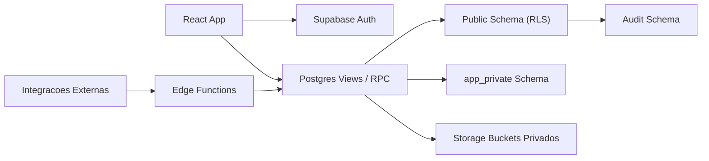

# Arquitetura

## Objetivo

O Genius Support OS nasce como plataforma interna de suporte e operação, mas
deve ser desenhado desde o primeiro ciclo para suportar evolução para produto
multi-tenant comercializável.

## Diretrizes obrigatórias

- Backend concentra regras de negócio, autorização e persistência.
- Frontend não decide permissão nem calcula estado crítico.
- Toda entidade operacional relevante precisa de trilha de auditoria.
- Nada entra em produção sem tenant, ownership e política de acesso definidos.
- Integrações e IA só operam sobre dados versionados e rastreáveis.

## Bounded contexts iniciais

### 1. Identity and Access

Responsável por autenticação, papéis globais, memberships por tenant e funções
auxiliares de autorização.

### 2. Tenant Management

Representa cada cliente/conta do Genius Return, seus contatos, status,
membership e escopo de dados.

### 3. Ticketing and Support Operations

Recebe tickets, mensagens, eventos, filas, anexos, SLAs e timeline operacional.

### 4. Knowledge Management

Armazena espaços de conhecimento, artigos, revisões, origem do conteúdo e
histórico editorial.

### 5. Engineering Intake

Converte dor operacional em backlog rastreável sem acoplar suporte e
engenharia no mesmo fluxo de trabalho.

### 6. Audit and Compliance

Garante rastreabilidade append-only para ações críticas, mudanças de estado,
operações sensíveis e leitura forense.

## Desenho lógico

## Regras de runtime

- Leituras do frontend devem preferir views seguras e queries tipadas.
- Escritas relevantes devem passar por RPCs/funcoes de dominio ou mutacoes com
  invariantes fortes no banco.
- Views expostas ao cliente devem obedecer RLS e usar `security_invoker` quando
  aplicavel.
- Storage deve operar com buckets privados e politicas por tenant.
- Integracoes assicronas ficam fora do frontend e entram por Edge Functions,
  filas ou jobs.

## Schemas recomendados

- `public`: entidades operacionais expostas via API com RLS obrigatoria.
- `app_private`: funcoes internas, automacoes, helpers de autorizacao e logica
  nao exposta diretamente.
- `audit`: trilha append-only e artefatos forenses.

## Decisao de frontend

O diretório `apps/web/` existe apenas como placeholder de produto. Nenhuma UI
deve ser construída antes de:

1. fechar o modelo de dados;
2. definir as funções de autorização;
3. estabelecer os contratos de leitura e escrita;
4. decidir os eventos auditáveis obrigatórios.
