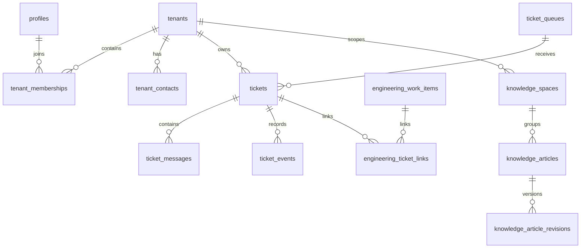

# Modelo Inicial de Dados

## Premissas

- Toda entidade de negocio relevante deve carregar `tenant_id` quando aplicavel.
- O auth provider autentica; o banco autoriza.
- Historico operacional e historico forense sao preocupacoes diferentes.
- O modelo ja precisa suportar clientes vendo seus proprios tickets no futuro.

## Entidades principais

### Identidade e tenancy

- `profiles`
  - espelho operacional do usuario autenticado.
- `user_global_roles`
  - papeis globais internos, como `platform_admin` e `support_agent`.
- `tenants`
  - conta/cliente do Genius Return.
- `tenant_memberships`
  - vinculo do usuario a um tenant com papel especifico.
- `tenant_contacts`
  - contatos do cliente, com ou sem login.

### Operacao de suporte

- `ticket_queues`
  - filas internas de atendimento.
- `tickets`
  - caso principal, sempre referenciando tenant.
- `ticket_messages`
  - conversa do ticket com visibilidade `internal` ou `customer`.
- `ticket_events`
  - timeline operacional derivada de mudancas e acoes.
- `attachments`
  - metadados de arquivos no Storage, nunca o binario em tabela.

### Conhecimento

- `knowledge_spaces`
  - espacos de conhecimento internos ou por tenant.
- `knowledge_articles`
  - metadado do artigo e ponteiro para a revisao atual.
- `knowledge_article_revisions`
  - historico editorial imutavel.

### Interface com engenharia

- `engineering_work_items`
  - bugs, melhorias, tarefas e incidentes.
- `engineering_ticket_links`
  - relacao N:N entre ticket e demanda tecnica.

### Compliance

- `audit.audit_logs`
  - log append-only para trilha forense.

## Relacionamentos

## Regras de modelagem

- `tickets` e `ticket_messages` precisam de colunas textuais normalizadas para
  leitura e indexacao (`body_markdown` e `body_text`).
- `knowledge_article_revisions` nao deve ser sobrescrita; nova versao gera nova
  linha.
- `engineering_work_items` nao compartilham workflow de ticket. O vinculo e por
  relacao, nao por mistura de tabelas.
- `attachments` guardam bucket, path, mime type, tamanho e sensibilidade.
- `audit.audit_logs` deve registrar pelo menos ator, tenant, entidade, acao,
  estado anterior, estado posterior e metadata.

## Preparacao para IA

Nao habilitar vetores no primeiro ciclo de modelagem operacional. Quando a base
de conhecimento estiver curada e versionada, criar uma estrutura separada, por
exemplo:

- schema `ai`;
- tabela `knowledge_revision_embeddings`;
- pipeline assicrono de embeddings;
- fila de reprocessamento e retentativa.

Esse desenho segue a orientacao atual da propria documentacao do Supabase para
embeddings assíncronos com `pgvector`, `pgmq`, `pg_net` e `pg_cron`, evitando
acoplamento prematuro do fluxo de IA ao CRUD operacional.
